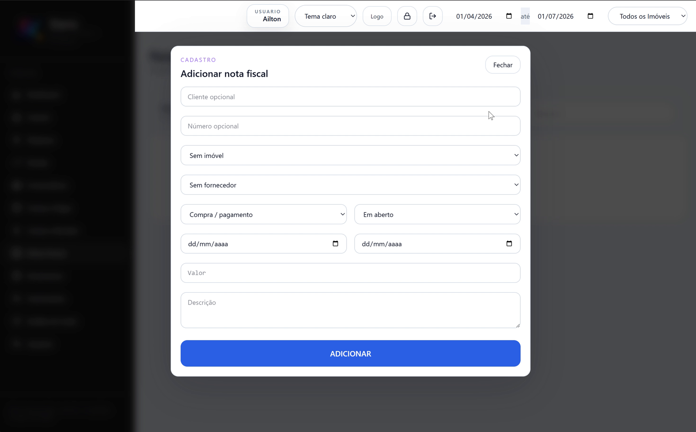
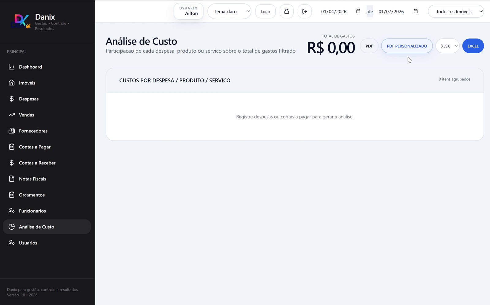

# Danix Desktop Offline

Offline-first desktop management system for real estate investment control, local financial operations, invoices, suppliers, reports, user access, backups, and Windows desktop delivery.

Danix combines a Next.js/React interface, internal API routes, local SQLite persistence, and Electron packaging to deliver a portable Windows application.

## Quick Start

### End users (portable app)

1. Download `Danix-Portable.zip` from GitHub Releases.
2. Extract the ZIP.
3. Run `Danix.exe`.

No external runtime installation is required for end users.

### Developers (source code)

Requirements:

- Node.js 20 LTS or newer
- npm
- Windows 10/11 for desktop packaging

Commands:

```cmd
npm install
npm run dev
npm run build
```

## Tech Stack

| Area | Technology |
|---|---|
| Interface | React + Next.js |
| Desktop runtime | Electron |
| Local server | Next.js standalone server |
| Database | SQLite |
| Database access | Drizzle ORM + better-sqlite3 |
| Language | TypeScript / JavaScript |
| Packaging | electron-builder |
| Runtime distribution | Portable Node bundled in Release package |
| Reports | PDF / print flow + Excel export |
| Validation | Typecheck, ESLint, API smoke tests, CRUD smoke tests, visual smoke tests |
| Platform | Windows desktop |

## Main Features

- Financial dashboard for paid/open/overdue amounts with charts.
- Property management with linked financial and operational records.
- Expenses, sales, suppliers, payables, invoices, receivables, employees, and budgets.
- Local users, permissions, recovery flow, and administrative event logs.
- PDF/print and Excel exports.
- Local SQLite backup and restore.

## Screenshots

A few screens from the Danix desktop application.

<table>
  <tr>
    <td width="50%">
      <strong>Dashboard Overview</strong><br />
      
    </td>
    <td width="50%">
      <strong>User Permissions and Backup</strong><br />
      
    </td>
  </tr>
  <tr>
    <td width="50%">
      <strong>Properties Management</strong><br />
      
    </td>
    <td width="50%">
      <strong>Payables Overview</strong><br />
      
    </td>
  </tr>
  <tr>
    <td width="50%">
      <strong>Invoice Registration</strong><br />
      
    </td>
    <td width="50%">
      <strong>Cost Analysis</strong><br />
      
    </td>
  </tr>
</table>


## Development and Build

Run browser mode:

```cmd
dev-web.cmd
```

Run desktop dev mode:

```cmd
dev-desktop.cmd
```

Build portable package:

```cmd
build-portable.cmd
```

Valid distribution output:

```txt
dist-portable-ready/
```

Important: distribute the full ZIP (or full `win-unpacked` folder), not only `Danix.exe`.

## Internal API Routes

```txt
GET/POST/PUT/DELETE /api/properties
GET/POST/PUT/DELETE /api/expenses
GET/POST/PUT/DELETE /api/sales
GET/POST/PUT/DELETE /api/suppliers
GET/POST/PUT/DELETE /api/payables
GET/POST/PUT/DELETE /api/invoices
GET/POST/PUT/DELETE /api/employees
GET/POST/PUT/DELETE /api/receivables
GET/POST/PUT/DELETE /api/budgets

GET/POST            /api/backup
GET                 /api/admin-events
GET                 /api/health

GET                 /api/auth/status
POST                /api/auth/setup
POST                /api/auth/login
POST                /api/auth/logout
PUT                 /api/auth/password
POST                /api/auth/recover
PUT                 /api/auth/logo

GET/POST/PUT/DELETE /api/users
POST                /api/users/recovery-code
```

## Documentation

Detailed documentation is available in `docs/`:

- `docs/architecture.md`
- `docs/build-windows.md`
- `docs/backup-restore.md`
- `docs/security-model.md`
- `docs/validation-strategy.md`
- `docs/roadmap.md`

## Author

Ailton Santana Reis
