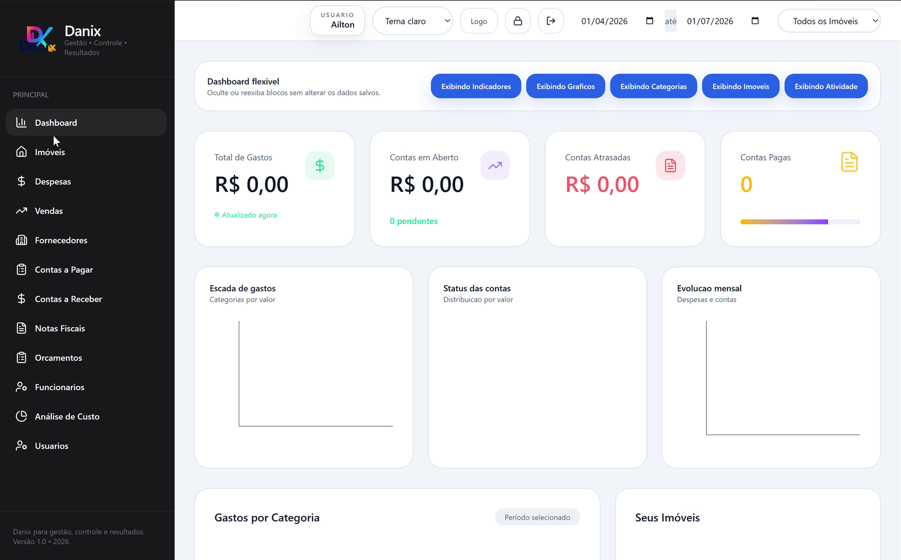
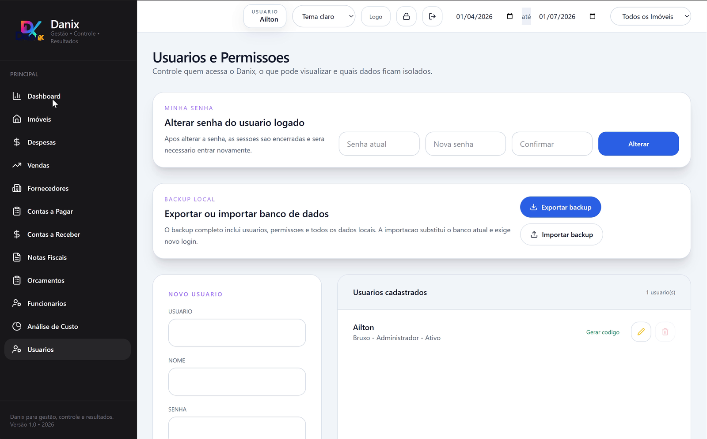
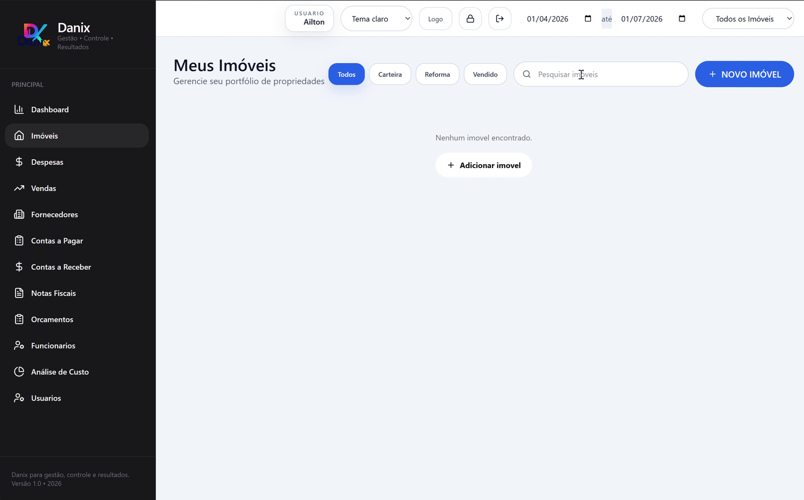
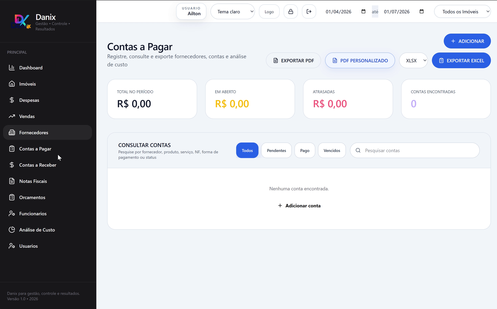

# Danix Desktop Offline

[](https://github.com/AiltonSantanaReis/Danix/actions/workflows/ci.yml)

Offline-first desktop management system for real estate investment control, local financial operations, invoices, suppliers, reports, user access, backups, and Windows desktop delivery.

Danix combines a Next.js/React interface, internal API routes, local SQLite persistence, and Electron packaging to deliver a portable Windows application.

---

## Quick Start

### End users

Danix is distributed as a portable Windows desktop application.

No external runtime installation is required for end users.

1. Download `Danix-Portable.zip` from the [GitHub Releases](https://github.com/AiltonSantanaReis/Danix/releases).
2. Extract the ZIP file.
3. Run `Danix.exe`.

> Important: distribute the full ZIP file or the full extracted folder, not only `Danix.exe`.

### Developers

Requirements:

- Node.js 20 LTS or newer
- npm
- Windows 10/11 for desktop packaging

Install dependencies:

```bash
npm install
```

Run in development mode:

```bash
npm run dev
```

Run desktop development mode:

```bash
npm run dev:desktop
```

---

## Tech Stack

| Area | Technology |
|---|---|
| Interface | React + Next.js |
| Desktop Runtime | Electron |
| Local Server | Next.js standalone server |
| Database | SQLite |
| Database Access | Drizzle ORM + better-sqlite3 |
| Language | TypeScript / JavaScript |
| Packaging | electron-builder |
| Runtime Distribution | Portable Node bundled in Release package |
| Reports | PDF / print flow + Excel export |
| Validation | Typecheck, ESLint, API smoke tests, CRUD smoke tests, visual smoke tests |
| Platform | Windows desktop |

---

## Main Features

- Financial dashboard for paid/open/overdue amounts with charts.
- Property management with linked financial and operational records.
- Expenses, sales, suppliers, payables, invoices, receivables, employees, and budgets.
- Local users, permissions, recovery flow, and administrative event logs.
- PDF/print and Excel exports.
- Local SQLite backup and restore.
- Portable Windows desktop distribution.

---

## Screenshots

A few core screens from the Danix desktop application.

<table>
  <tr>
    <td width="50%">
      <strong>Dashboard Overview</strong><br />
      
    </td>
    <td width="50%">
      <strong>User Permissions and Backup</strong><br />
      
    </td>
  </tr>
  <tr>
    <td width="50%">
      <strong>Properties Management</strong><br />
      
    </td>
    <td width="50%">
      <strong>Payables Overview</strong><br />
      
    </td>
  </tr>
</table>

---

## Development and Build

Run browser mode:

```bash
npm run dev:web
```

Run desktop dev mode:

```bash
npm run dev:desktop
```

Build source code:

```bash
npm run build
```

Build portable package:

```bash
npm run build:desktop
```

Run validation:

```bash
npm run typecheck
npm run lint
npm run build
```

Run smoke tests:

```bash
npm run smoke:api
npm run smoke:backup
npm run smoke:crud
npm run smoke:security
```

---

## Internal API

Danix uses internal Next.js API routes for local CRUD operations, authentication, backup, reports, and user management.

More details are available in [docs/architecture.md](docs/architecture.md).

---

## Documentation

Detailed documentation is available in `docs/`:

- [Architecture](docs/architecture.md)
- [Windows Build](docs/build-windows.md)
- [Backup and Restore](docs/backup-restore.md)
- [Security Model](docs/security-model.md)
- [Validation Strategy](docs/validation-strategy.md)
- [Roadmap](docs/roadmap.md)

---

## Project Status

Danix v1.0.0 is available as a portable Windows desktop release.

The current version focuses on offline execution, local persistence, user management, reports, backups, and desktop packaging.

Planned improvements include:

- Splitting the main application screen into feature-based modules.
- Improving automated release workflows.
- Expanding visual documentation.
- Strengthening desktop smoke validation.
- Improving long-term maintainability of UI components.

---

## Author

Ailton Santana Reis
